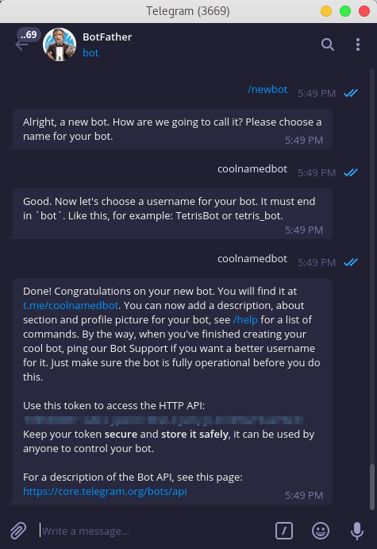
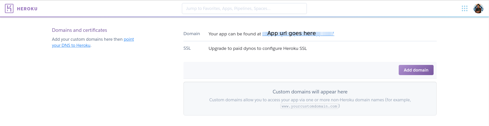
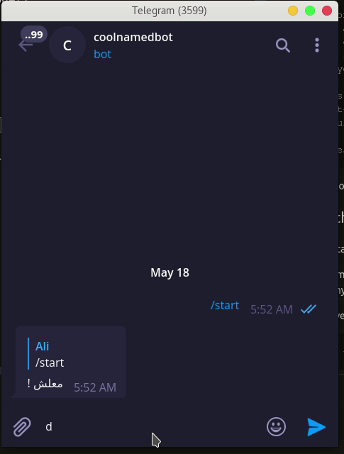

# Telegram bot tutorial using python and flask


[img source](https://www.wikitechy.com/technology/wp-content/uploads/2017/05/Telegram-Bots.png)

in this tutorial you will learn how to make a telegram bot and deploy it on a heroku server, the bot will be up 24-7, and you can inject your own brain and responses into it.

## Before we start

you will need to have the following

* a [heroku](https://signup.heroku.com/) free account
* a [telegram](https://telegram.org/) account of course

## Create the bot on telegram first



before we dive into coding, let's finish the easy stuff, we need to ask telegram to create a new bot on the platform, it's a fairly simple process, you can do so in your telegram app(on [windows/linux/android/ios/web](https://telegram.org/apps)) you need to go to [botfather](https://telegram.me/botfather) which is basically a bot himself that automate the process of creating your bot.

you will need to ask him using the `/` prefix to start a command, once you start typing it will autocomplete itself, the command you need is `/newbot`, which will take you to the flow of creating your bot, the bot will prompt you for a name and username for the bot (the username has to be unique), then it will respone with a message like so

```text
Done! Congratulations on your new bot. You will find it at t.me/{bot-username}. You can now add a description, about section and profile picture for your bot, see /help for a list of commands. By the way, when you've finished creating your cool bot, ping our Bot Support if you want a better username for it. Just make sure the bot is fully operational before you do this.

Use this token to access the HTTP API:
{the-bot-token-which-we-will-use-later}
Keep your token secure and store it safely, it can be used by anyone to control your bot.

For a description of the Bot API, see this page: https://core.telegram.org/bots/api
```

congratulations you now have your bot on the platform!

## Coding the bot engine

before we start please note the following

* i assume you use python3
* also my environment is ubuntu 18, it's unlikely that this will affect your project thought.

now let's dive into some code, let's start of by creating a [virtualenv](https://docs.python.org/3/library/venv.html) for our project, in your terminal type

```cmd
$python -m venv venv/
```

now you will have a `venv/` directory which will have all the python libraries we will be using, go ahead and activate the `virtualenv` using the following command

```cmd
$source venv/bin/activate
```

now let's have some libs installed

```cmd
(venv) $pip install flask
(venv) $pip install python-telegram-bot
(venv) $pip install requests
```

that's all we need for now, let's structure our project in a neat way before we start the real coding

```cmd
.
├── app.py
├── telebot
│   ├── credentials.py
│   ├── mastermind.py
│   |   .
│   |   you can build your engine here
│   |   .
│   └── __init__.py
└── venv
```

in the `credentials.py` file we will need three variables

```python
bot_token = "place your token here"
bot_user_name = "bot username"
URL = "the heroku app link that we will create later"
```

in `mastermind.py` you could use your super AI to generate response

```python
def get_response(msg):
    """
    you can place your mastermind AI here
    could be a very basic simple response like "معلش"
    or a complex LSTM network that generate appropriate answer

    """
    return "معلش !"
```

now let's go back to our `app.py` and go throw the code step by step

```python
# import everything
from flask import Flask, request
import telegram
from telebot.credentials import bot_token, bot_user_name,URL
from telebot.mastermind import get_response
```

now let's create global objects for the bot and the token

```python
global bot
global TOKEN
TOKEN = bot_token
bot = telegram.Bot(token=TOKEN)
```

at this point we have the `bot` object which is connected to your actuall bot using the token you have copied from the botfather message we saw earlier.

```python
# start the flask app
app = Flask(__name__)
```

now we need to bind functions to specific routes, in other words, we need to tell flask what to do when a specific address is called, more info about flask and route can be found [here](http://flask.pocoo.org/docs/1.0/quickstart/)

```python
"""
here the route function respond to a url which is basically /{token} which is the url telegram will call to get responses for the messages sent to him.
"""
@app.route('/{}'.format(TOKEN), methods=['POST'])
def respond():
    # retrieve the message in JSON and then transform it to Telegram object
    update = telegram.Update.de_json(request.get_json(force=True), bot)

    # get the chat_id to be able to respond to the same user
    chat_id = update.message.chat.id
    # get the message id to be able to reply to this specific message
    msg_id = update.message.message_id

    # Telegram understands UTF-8, so encode text for unicode compatibility
    text = update.message.text.encode('utf-8').decode()
    print("got text message :", text)

    # here we call our super AI
    response = get_response(text)

    # now just send the message back
    # notice how we specify the chat and the msg we reply to
    bot.sendMessage(chat_id=chat_id, text=response, reply_to_message_id=msg_id)

    return 'ok'

```

that's great but we need to tell telegram to call our app (the one we will create in a minute) so that our function can be invoked, for this we will use [webhook](https://www.wikiwand.com/en/Webhook) which is in a very basic words, a way to let the bot call our server whenever a message is called, so that we dont need to make our server suffer in a while loop waiting for a message to come.

```python
# the route here can be anything, you the one who will call it
@app.route('/setwebhook', methods=['GET', 'POST'])
def set_webhook():
    # we use the bot object to link the bot to our app which live
    # in the link provided by URL
    s = bot.setWebhook('{URL}{HOOK}'.format(URL=URL, HOOK=TOKEN))
    # something to let us know things work
    if s:
        return "webhook setup ok"
    else:
        return "webhook setup failed"
```

now everything is set, let's just make a fancy home page so that we know the engine is up

```python
@app.route('/')
def index():
    return '.'
```

an app can't run without a main right

```python
if __name__ == '__main__':
    # note the threaded arg which allow
    # your app to have more than one thread
    app.run(threaded=True)
```

that's the last code you will write today, now to the last step, launching our app on heroku.

## Launch our app on heroku

we need a couple of things before we make our app.

* heroku can't know what libraries your project uses, so we have to tell him using the `requirements.txt` file (a common problem is that you misspell requirements so be careful :D), to generate the requirements file use pip

    ```cmd
    $pip freeze > requirements.txt
    ```

    now you have your requirements file ready to go

* second you need the `Procfile` which tells heroku where our app starts, so create a `Procfile` file and in it type the following

    ```cmd
    web: gunicorn app:app
    ```

* **A bounce step**: you can add [.gitignore](https://github.com/github/gitignore/blob/master/Python.gitignore) file to your project so that no-use files don't get uploaded to the repository.

* from your [dashboard](https://dashboard.heroku.com/apps) on heroku create a new app, once you create an app it will direct you to the deploy page, open the **settings** tab in new window and copy the domain of the app which will be something like `https://appname.herokuapp.com/` and paste it in the URL variable inside our `credentials.py`



now go back to the **deploy** tab and proceed with the steps:
  * login to heroku

    ```cmd
    $heroku login
    ```

    note that sometimes this method get stuck in `waiting for login`, if this is the case with you, you can login using

    ```cmd
    $heroku login -i
    ```

  * Initialize a git repository in our directory

    ```cmd
    $git init
    $heroku git:remote -a {heroku-project-name}
    ```

  * Deploy the app

    ```cmd
    $git add .
    $git commit -m "first commit"
    $git push heroku master
    ```

* at this point you will see the building progress in your terminal, if everything went okay you will see something like so

    ```cmd
    remote: -----> Launching...
    remote:        Released v6
    remote:        https://project-name.herokuapp.com/ deployed to Heroku
    remote:
    remote: Verifying deploy... done.
    ```

* Now go to the app page (the link of the domain you copied before) and add to the end of the link `/setwebhook` so that the address will be something like `https://appname.herokuapp.com/setwebhook`, if you see `webhook setup ok` then you are ready to go!

## Now go talk to your bot



## Additional reads

* [Building a Chatbot using Telegram and Python](https://www.codementor.io/garethdwyer/building-a-telegram-bot-using-python-part-1-goi5fncay)
* [Setting your Telegram Bot WebHook the easy way](https://medium.com/@xabaras/setting-your-telegram-bot-webhook-the-easy-way-c7577b2d6f72)
* [python-telegram-bot Repository](https://github.com/python-telegram-bot/python-telegram-bot)
* [Deploying with Git on Heruko](https://devcenter.heroku.com/articles/git)
* [Python Telegram Bot’s documentation](https://python-telegram-bot.readthedocs.io/en/stable/index.html)